# Customer Success Control Tower

An explainable early-warning system for **Microsoft Unified support cases**. It turns the support e-mail a Customer Success Account Manager (CSAM) already receives — case notifications, TrackingID threads, Critical Situation notices and customer meetings — into a ranked, explainable view of case and account risk, with a recommended next step for every case.

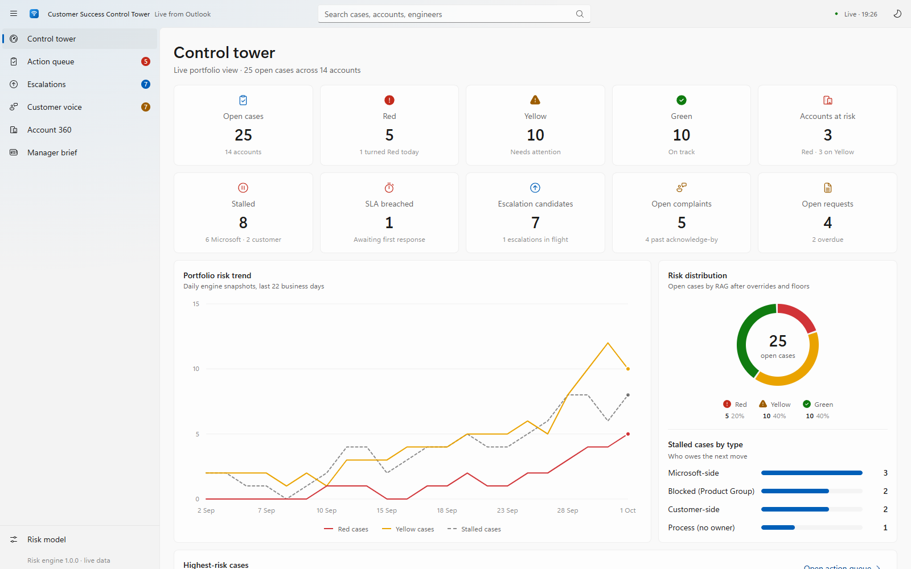

> **All data in this repository is fictional.** Company names (Contoso, Fabrikam, Woodgrove Bank, …), people, e-mail addresses, case numbers and Engage Center workspaces are invented for demonstration purposes.

## Why

A CSAM typically follows dozens of open cases across many accounts, and the warning signs are scattered across e-mail threads: an engineer who has not replied for three business days, a customer who has chased twice, a "please escalate" buried in a reply, a Sev A that has silently aged past its target. The Control Tower reads those signals continuously, scores every case with a transparent model, and tells you what to do today and why.

## Features

- **Explainable risk score (0–100)** for every open case, built from six capped factors: severity, momentum/stall, age, SLA and commitments, customer voice, and exposure. Every point is listed as a driver.
- **RAG with hard rules** — Red overrides (R1–R5) and Yellow floors (Y1–Y6) make sure a Sev 1, an explicit escalation request or a breached first-response SLA can never hide behind an average score.
- **Stall detection on a business-day calendar** (time zone and public holidays are configurable): Microsoft-side, blocked on the product group, customer-side, no owner, missed commitment, and "blind spot" cases with no visible correspondence.
- **Customer voice detection** — complaints, escalation requests, RCA / SME / action-plan / workshop requests, executive mentions, sentiment and chasers, using bilingual keyword rules (English and Turkish).
- **Escalation triggers (E1–E11)** with a suggested escalation level (L1 engineer's manager → L4 executive alignment), an escalation-pack builder and readiness checklist.
- **Playbooks (PB-00 – PB-13)** that turn each situation into a concrete next step.
- **Case sheet** — facts, score breakdown, recommended workflow, timeline and escalation pack for every case. While a case is still awaiting its first response, the sheet shows when it is due or since when it is overdue (around the clock for Sev 1/A, business hours for Sev B/C) and explains when only automatic notices have arrived so far.
- **Account 360** — account risk roll-up, contract renewal window, CSM concern, MIRP (Engage Center) confirmation status and expiry, last/next customer meeting, and recommended account actions.
- **Manager brief** — a daily summary with week-over-week trend that can be copied into Teams or e-mail.
- **Risk simulator** — runs the production scoring function so thresholds can be calibrated with your manager.
- **Shared read-only snapshot** — a self-contained HTML copy published on a schedule (for example to a OneDrive folder) that opens safely in the OneDrive/SharePoint preview.
- Light and dark theme, keyboard navigation, global search, and a layout that adapts to narrow windows.

## Screenshots

| Action queue | Case detail and score breakdown |
| --- | --- |
| 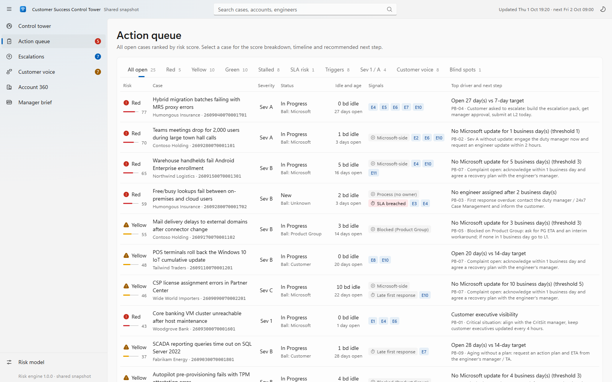 | 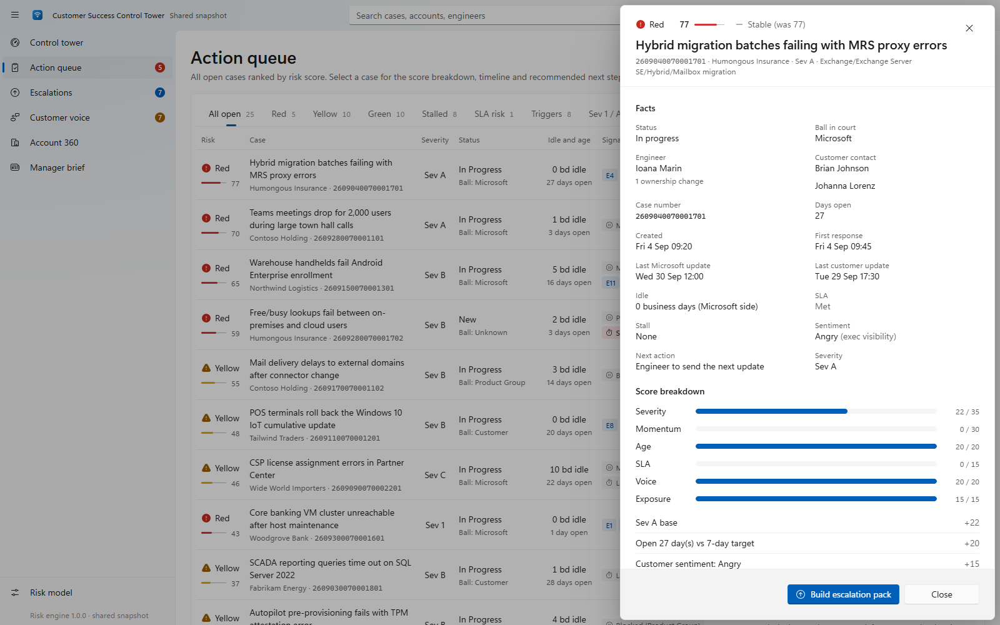 |
| **Account 360** | **Customer voice** |
| 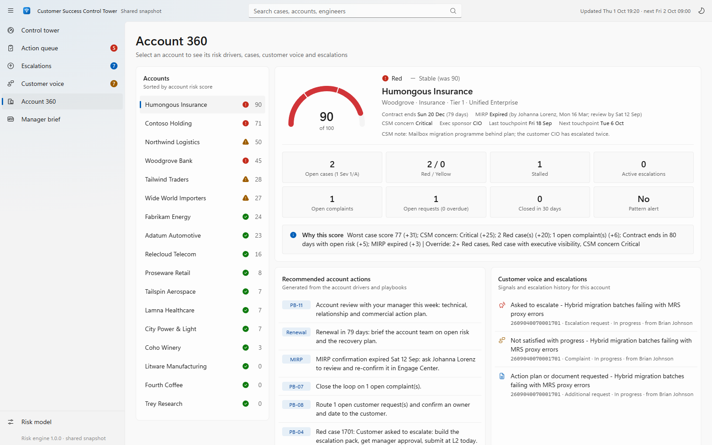 | 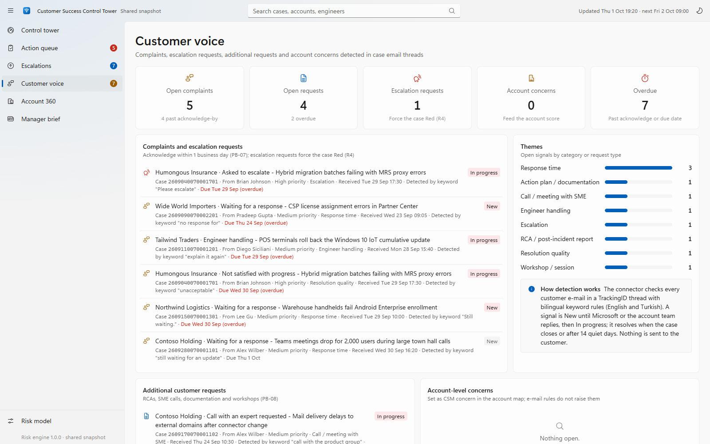 |
| **Escalations** | **Manager brief** |
| 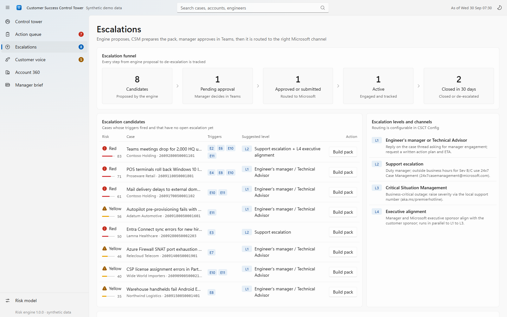 | 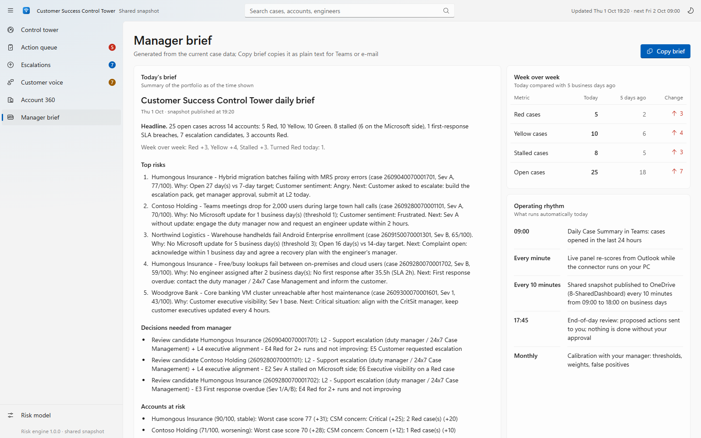 |
| **Risk model simulator** | **Dark theme** |
| 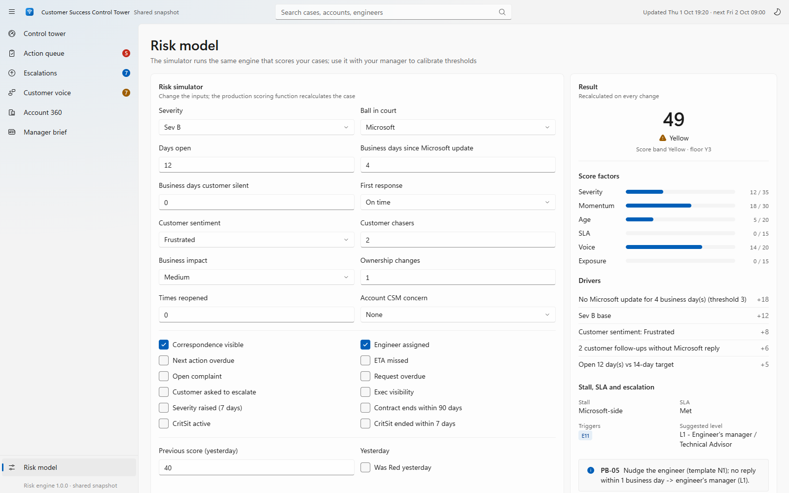 | 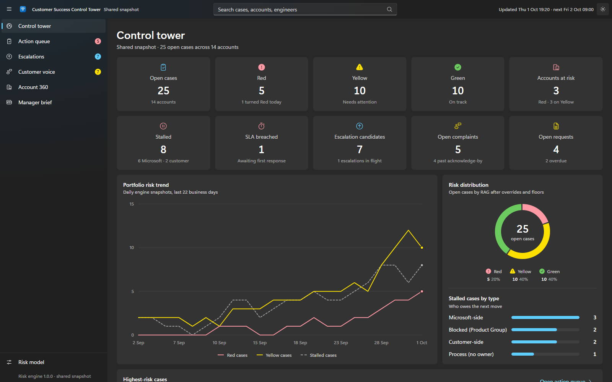 |
| **Case awaiting its first response** | **Narrow window** |
| 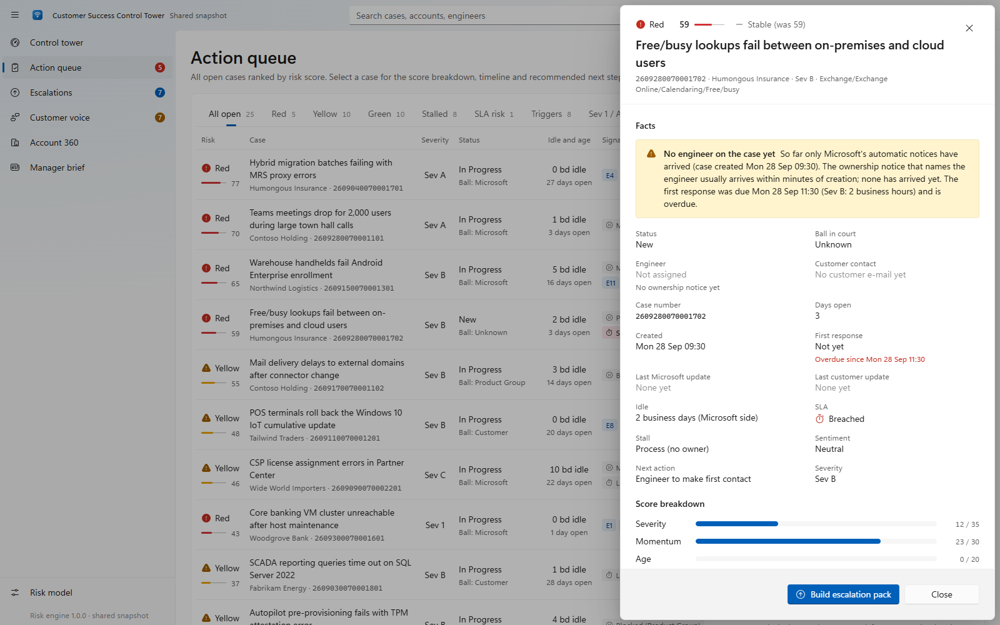 | 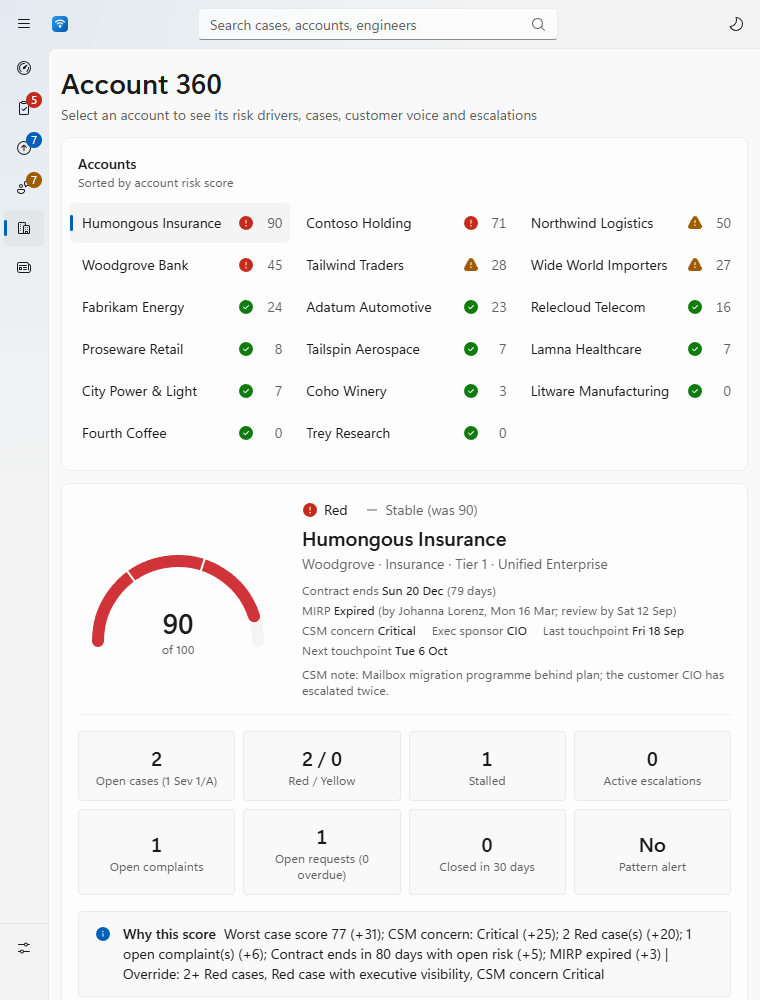 |

## Architecture

The same scoring engine runs in two delivery paths.

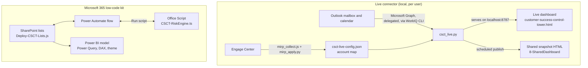

- **Live connector** — a dependency-free Python process that reads support-case e-mail with the signed-in user's own Microsoft 365 permissions, normalises every message into a case event, and serves the dashboard on `127.0.0.1` only. Case data is kept in memory.
- **Dashboard** — a single HTML file (vanilla JavaScript, no build step, no external requests) that replays the case events, runs the risk engine in the browser and renders every page. The same file works in three modes: *demo* (embedded synthetic data), *live* (served by the connector) and *snapshot* (embedded published data, read-only).
- **Microsoft 365 kit** — the same engine as an Office Script, a SharePoint list schema with views and column formatting, and a Power BI model for portfolio reporting.

## Repository structure

| Path | Contents |
| --- | --- |
| `1-SharePoint/Deploy-CSCT-Lists.js` | Browser-console provisioning script: creates 8 Microsoft Lists (Accounts, Cases, Case Events, Signals, Escalations, Daily Snapshot, Review Log, Config) with typed columns, indexes, views and RAG formatting, seeds the configuration and optionally a synthetic demo dataset. Idempotent, supports a dry run. |
| `1-SharePoint/formatting/` | JSON column and row formatters (RAG pill, risk-score bar, SLA status, severity, stalled chip, readiness bar, …). |
| `2-PowerAutomate/CSCT-RiskEngine.ts` | The risk engine as an Office Script (Excel on the web), called from a Power Automate flow with one `inputJson` parameter. |
| `3-PowerBI/` | Power Query (M) queries for every list, model tables and relationships, a DAX measure pack and a report theme. |
| `6-SampleData/` | Self-contained demo dashboard with synthetic data, plus an engine input/output sample. |
| `7-LiveConnector/` | Live connector (`csct_live.py`), configuration and account map, live dashboard, snapshot template, start/stop scripts and the MIRP status tools. |
| `8-SharedDashboard/` | Example of the published read-only snapshot (generated by the connector from a fictional mailbox). |
| `docs/screenshots/` | Images used in this README. |

Teams adaptive cards and the Copilot agent from the original design are not part of this repository, which is why folders 4 and 5 are missing from the numbering.

## Getting started

### 1. Explore the demo (no installation)

Open [`6-SampleData/customer-success-control-tower-demo.html`](6-SampleData/customer-success-control-tower-demo.html) in Edge or Chrome. It contains 40 synthetic cases across 12 fictional accounts.

The published-snapshot example is [`8-SharedDashboard/Customer-Success-Control-Tower-Daily.html`](8-SharedDashboard/Customer-Success-Control-Tower-Daily.html). Because it is a static example, it shows a "Not updated recently" notice when opened later.

### 2. Run the live connector

Requirements:

- Windows with Python 3.10 or later (standard library only, no packages to install).
- The WorkIQ CLI, installed with Microsoft Scout and signed in to Microsoft 365. The connector looks for `%USERPROFILE%\.scout\bin\workiq.cmd`; set `CSCT_WORKIQ_EXE` to use another location.

Steps:

1. Describe your accounts in `7-LiveConnector/csct-live-config.json` (see [Configuration](#configuration)).
2. Run `7-LiveConnector/Start-ControlTower.cmd`. The first sync reads about four months of support-case e-mail; the dashboard opens at <http://127.0.0.1:8787/>.
3. Stop it with `Stop-ControlTower.cmd`.

Command-line options (run from `7-LiveConnector`):

```text
pythonw csct_live.py [--open]    run the connector (and open the dashboard)
python  csct_live.py --once      one sync, print a per-case summary, exit
python  csct_live.py --publish   one sync, publish the shared snapshot now, exit
```

Only one connector runs per user. While it runs, new e-mail is checked every `pollSeconds`, a full sync runs every `fullSyncMinutes`, and the shared snapshot is published on business days according to `settings.publish`.

### 3. Track MIRP confirmations (optional)

1. Run `mirp_collect.js` with Playwright in a browser session signed in to Engage Center. It replays the portal's own read-only queries for every workspace you can see and leaves the result in the page; save it as `mirp-latest.json`.
2. Run `python mirp_apply.py [--dry-run] [--publish]` to update `MIRPStatus`, `MIRPConfirmedOn` and `MIRPConfirmedBy` in the account map and print a summary (pending accounts, confirmations that expire within 30 days, exceptions, and workspaces that are not in the account map).

Try it with the fictional sample: `python 7-LiveConnector/mirp_apply.py --dry-run --force`.

### 4. Deploy the Microsoft 365 kit (optional)

1. **SharePoint** — open the target site, press F12, optionally set `window.CSCT_OPTIONS = { seedDemo: true }` (or `{ dryRun: true }`), then paste `Deploy-CSCT-Lists.js` into the console.
2. **Risk engine** — in Excel on the web, open *Automate → New script*, paste `CSCT-RiskEngine.ts` and save it as `CSCT-RiskEngine`. Call it from a Power Automate flow with *Excel Online (Business) → Run script*, passing the cases, accounts, signals, escalations and configuration as `inputJson`.
3. **Power BI** — create the `SiteUrl` parameter and the queries from `CSCT-PowerQuery.pq`, add the tables from `CSCT-Model-Tables.dax`, run `CSCT-Measures.dax` in DAX query view to add the measures, and import `CSCT-Theme.json`.

## Configuration

`7-LiveConnector/csct-live-config.json` has two parts. Changes apply on the next sync.

**`settings`**

| Setting | Default | Meaning |
| --- | --- | --- |
| `port` | `8787` | Local port of the dashboard and API. |
| `pollSeconds` / `fullSyncMinutes` | `60` / `60` | Incremental check interval and full re-sync interval. |
| `lookbackDays` | `120` | How far back case e-mail is read. |
| `staleCaseDays` | `21` | A case with no activity for this long is treated as inactive. |
| `calendarPastDays` / `calendarFutureDays` | `120` / `60` | Window for the last and next customer meeting per account. |
| `dashboard` | `customer-success-control-tower.html` | Dashboard file served at `/`, relative to the connector folder. |
| `accountTeam` | `[]` | Extra account-team addresses whose messages count as account-team updates. |
| `publish.*` | every 10 minutes, 09:00–18:00, UTC+3 | Shared snapshot schedule, target folder and file name. `includeEmailText` and `includeContactEmails` control whether e-mail text and sender addresses are included. |
| `mirp.ignoreWorkspaces` | `[]` | Engage Center workspaces that are not accounts (for example group-level umbrella workspaces). |

**`accounts`** — one entry per customer account:

| Field | Purpose |
| --- | --- |
| `Title`, `Group` | Account name and optional group/holding for roll-ups. |
| `Aliases`, `Domains` | Names and e-mail domains used to map case e-mail to the account. |
| `Segment`, `Industry`, `StrategicTier`, `ContractType` | Profile shown in Account 360. |
| `ContractEnd` | Drives the renewal-window factor (90 days). |
| `CSMConcern`, `CSMConcernNote` | `None`, `Watch`, `Concern` or `Critical`; adds account risk. |
| `CustomerExecSponsor` | Shown in Account 360. |
| `MIRPStatus`, `MIRPAsOf`, `MIRPConfirmedOn`, `MIRPConfirmedBy`, `MIRPWorkspace`, `MIRPNote` | Engage Center MIRP status, maintained by `mirp_apply.py`. A confirmation is valid for 180 days. |

Cases that cannot be mapped are still shown, under the customer name from the notification or the customer's e-mail domain, and flagged as "not in the account map".

## Risk model

| Factor | Cap | Scoring |
| --- | ---: | --- |
| Severity | 35 | Sev 1 = 35, Sev A = 22, Sev B = 12, Sev C = 3 |
| Momentum / stall | 30 | Microsoft idle vs stall threshold: ≥0.5× = 8, ≥1× = 18 (stalled), ≥2× = 25; customer silence ≥ threshold = 6, ≥2× = 10; no engineer after 1 business day = 18; blind spot +5 |
| Age | 20 | ≥0.5× target = 5, ≥1× = 15, ≥2× = 20 (targets: Sev 1 3 days, A 7, B 14, C 30) |
| SLA and commitments | 15 | No first response past SLA = 15, at risk = 5, late first response = 5, next action overdue = 8, ETA missed = 8 |
| Customer voice | 20 | Frustrated = 8 / Angry = 15, open complaint = 8, 2+ chasers = 6, overdue request = 4 |
| Exposure | 15 | Executive visibility = 8, business impact High = 4 / Critical = 8, 3+ owners = 5, reopened = 5, severity raised in 7 days = 5, account concern = 3/6, renewal within 90 days = 3 |

- **RAG:** Green < 30 ≤ Yellow < 60 ≤ Red.
- **Hard Red overrides:** R1 Sev 1 or Critical Situation active · R2 Sev A with no Microsoft update for a business day · R3 awaiting first response past SLA (Sev 1/A/B) · R4 customer asked to escalate · R5 angry customer with executive visibility.
- **Yellow floors:** Y1 open Sev A · Y2 open complaint · Y3 stalled · Y4 open 30+ days · Y5 Critical Situation ended in the last 7 days · Y6 first-response SLA breached.
- **Escalation triggers:** E1 Sev 1/CritSit (L3) · E2 Sev A stalled (L2) · E3 first response overdue (L2) · E4 Red for 2+ runs and not improving (L1) · E5 customer requested escalation (L2) · E6 executive visibility on a Red case (L4) · E7 aged 2× target without ETA (L1) · E8 ownership churn or repeated reopen (L1) · E9 account pattern of 3+ cases in one product within 14 days (L1) · E10 service-quality complaint (L1) · E11 customer chasing without a Microsoft reply (L1).
- **Account score:** worst case score × 0.4 plus capped points for Red/Yellow cases, active escalations, complaints, overdue requests, CSM concern, renewal with open risk, MIRP not confirmed and product patterns.

Every weight and threshold is a named setting (`CSCT Config` list in SharePoint, `CSCT_DEFAULTS` in the engine), so the model can be tuned without code changes.

## Privacy and data handling

- The connector uses the signed-in user's own delegated Microsoft 365 permissions; there is no app registration or service account.
- Case data is held in memory only. The local server answers requests addressed to `127.0.0.1`/`localhost` only, and state-changing endpoints require a custom header or a same-origin request.
- The shared snapshot never contains mailbox links; e-mail text and sender addresses are left out unless `includeEmailText` / `includeContactEmails` are enabled. The snapshot page makes no network requests.
- `mirp_collect.js` only reads data and never returns, prints or stores the access token.
- Status, ball-in-court and customer signals are inferred from e-mail; confirm in the case record before acting.

## Tech stack

Python 3 (standard library only) · HTML, CSS and vanilla JavaScript (single file, no build step) · TypeScript Office Scripts · Power Automate · SharePoint REST API and JSON formatting · Power Query (M) and DAX · Playwright (MIRP collector) · Microsoft Graph.
